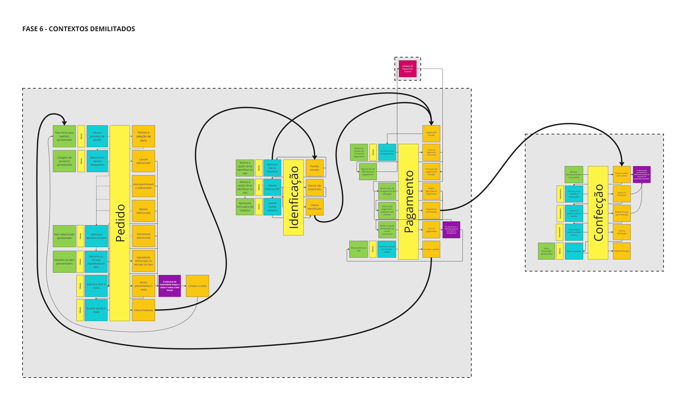

[](https://github.com/Grupo-68-FIAP/Fiap.McTech/actions/workflows/dotnet.yml) [](https://sonarcloud.io/summary/new_code?id=Grupo-68-FIAP_Fiap.McTech) [](https://sonarcloud.io/summary/new_code?id=Grupo-68-FIAP_Fiap.McTech) [](https://sonarcloud.io/summary/new_code?id=Grupo-68-FIAP_Fiap.McTech) [](https://sonarcloud.io/summary/new_code?id=Grupo-68-FIAP_Fiap.McTech)
# McTech - Sistema Gerenciador de Pedidos para Restaurantes

O McTech é um sistema completo de gerenciamento de pedidos desenvolvido especificamente para restaurantes, projetado para simplificar e otimizar os processos de pedidos, desde o momento em que são feitos até a sua conclusão. 
Utilizando tecnologias modernas e práticas arquiteturais, o MeTech oferece uma solução eficiente e escalável para restaurantes de todos os portes.

## Tecnologias Utilizadas
 - Plataforma: .NET 6.0
 - Banco de Dados: Microsoft SQL Server
 - Arquitetura de Software: Hexagonal (ou Ports and Adapters)
 - Padrão Arquitetural Adicional: Arquitetura em Cebola (ou Onion Architecture)

## Funcionalidades Principais
1. **Identificação do Cliente via CPF**
   - API que permite identificar o cliente através do CPF. Esta funcionalidade autentica o cliente e garante que ele está registrado no sistema antes de proceder com outras operações.

2. **Gerenciamento de Produtos**
   - **Criar Produtos:** API que permite a criação de novos produtos no sistema, incluindo detalhes como nome, descrição, preço e categoria.
   - **Editar Produtos:** API para atualizar informações de produtos existentes. Isso inclui alterações no nome, descrição, preço e categoria do produto.
   - **Remover Produtos:** API que permite a remoção de produtos do sistema, assegurando que produtos desatualizados ou descontinuados sejam removidos.

3. **Busca de Produtos por Categoria**
   - API que permite buscar produtos com base em suas categorias. Isso facilita a organização e acesso aos produtos, permitindo que os clientes filtrem produtos de acordo com suas preferências.

4. **Fake Checkout**
   - API que simula o processo de checkout. Nesta etapa, os produtos escolhidos pelo cliente são enviados para uma fila de pedidos. Este fake checkout não realiza transações reais, mas prepara os pedidos para finalização.

5. **Listar Pedidos**
   - API que lista todos os pedidos feitos pelos clientes. Esta funcionalidade permite que os clientes e administradores vejam o histórico de pedidos, incluindo detalhes sobre cada pedido, como produtos incluídos, data e status do pedido.

## Visão Geral do Sistema com DDD

- Em PDF: [Link para documento PDF](./Documentação%20do%20Sistema%20com%20DDD.pdf)
- No Miro: [Link para o Miro](https://miro.com/app/board/uXjVKVozBqw=/)



## Como Contribuir

1 - Reportar Problemas: Encontrou um bug ou tem uma sugestão de melhoria? Por favor, abra uma issue e descreva detalhadamente o problema ou sua ideia.

2 - Enviar Pull Requests: Se você deseja corrigir um problema ou adicionar uma nova funcionalidade, sinta-se à vontade para enviar um pull request. Certifique-se de seguir as diretrizes de contribuição.

3 - Melhorar a Documentação: A documentação clara e detalhada é essencial. Se você encontrar partes da documentação que podem ser aprimoradas, não hesite em fazer as alterações necessárias.


## Como Configurar e Executar o Projeto

1 - Verifique a instalação do Docker:

```sh
docker --version
```

2 - Verifique a instalação do Docker Compose:

```sh
docker-compose --version
```

3 - Navegue até o diretório do projeto:

```sh
cd Fiap.McTech
```

4 - Construir e iniciar os serviços:

```sh
docker-compose up -d
```

5 - Verificar se os containers estão rodando:

```sh
docker-compose ps
```

6 - Veja a documentação do projeto e teste as API's:

```sh
http://localhost:8080/swagger
```

## Equipe McTech
Agradecemos por considerar contribuir para o MeTech! Se tiver alguma dúvida ou precisar de assistência, não hesite em entrar em contato conosco.
